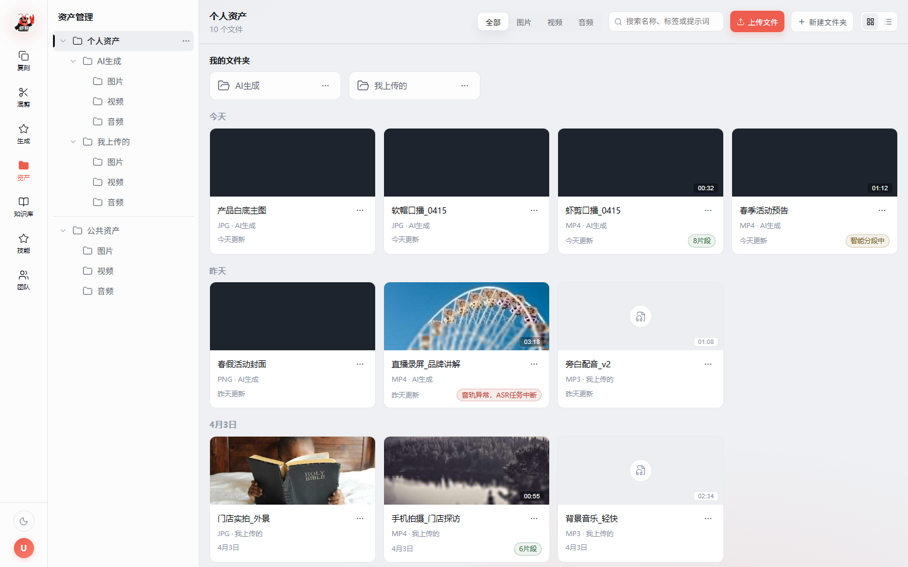
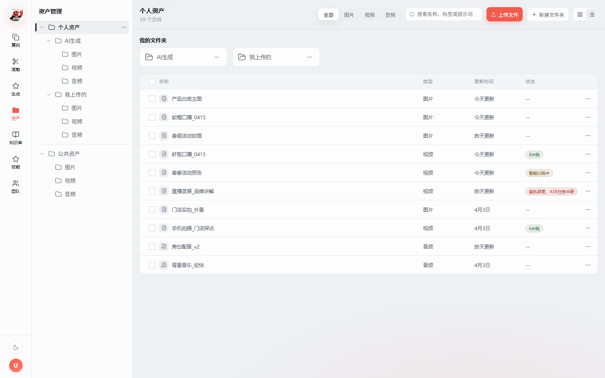
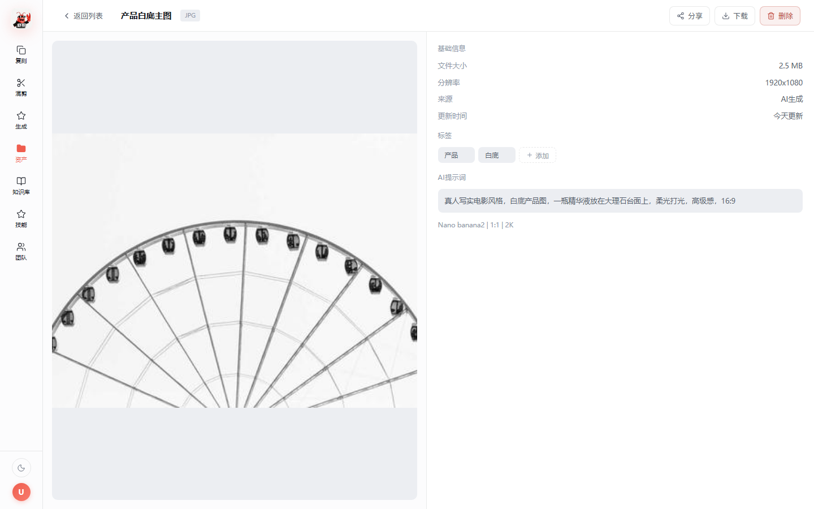
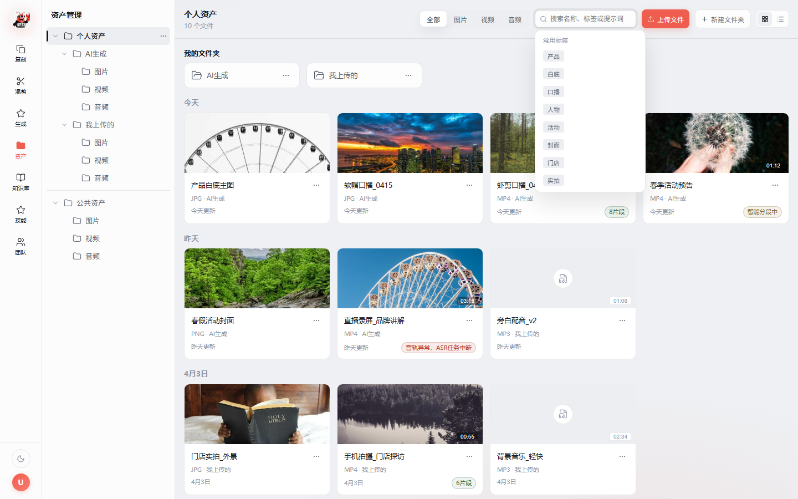
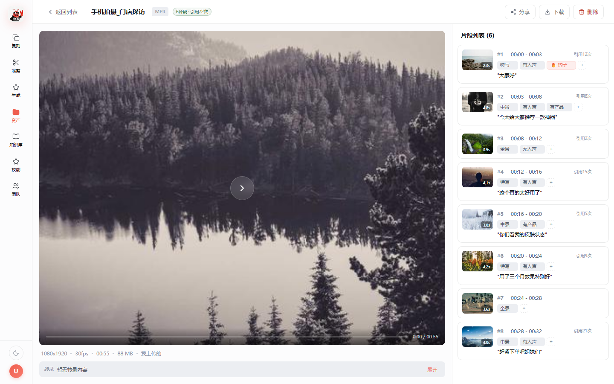
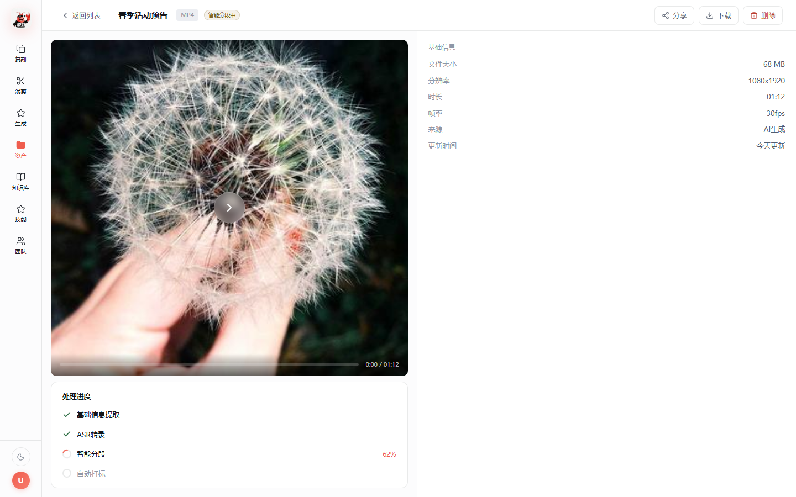
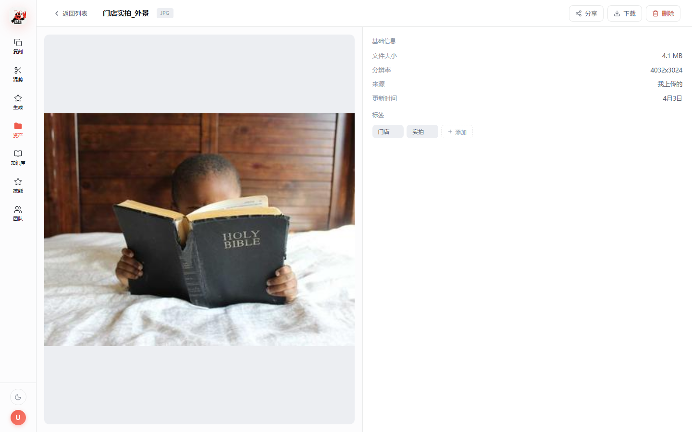

# 资产管理与素材处理系统 - 整合版需求文档

## 文档信息

| 项目 | 内容 |
|------|------|
| 文档版本 | V2.0 |
| 更新日期 | 2026-04-17 |
| 系统定位 | 统一的资产管理 + 视频智能处理 |
| 核心目标 | 管理所有多媒体资产，视频自动切片打标 |

---

## 1. 系统概述

### 1.1 统一架构

```
资产管理系统（统一入口）
├── 图片资产（简单存储）
├── 音频资产（简单存储）
└── 视频资产（智能处理）
    ↓
    上传后自动触发
    ↓
    ASR转录 → 智能分段 → 自动打标
    ↓
    带片段数据的视频资产
    ↓
    供AI混剪使用
```

### 1.2 资产分类

```
资产管理
├── 个人资产
│   ├── AI生成
│   │   ├── 图片
│   │   ├── 视频（自动处理）
│   │   └── 音频
│   └── 我上传的
│       ├── 图片
│       ├── 视频（自动处理）
│       └── 音频
│
└── 公共资产
    ├── 图片
    ├── 视频（自动处理）
    └── 音频
```

---

## 2. 数据模型

### 2.1 资产表（assets）

| 字段 | 类型 | 约束 | 说明 |
|------|------|------|------|
| id | string | PK | UUID |
| asset_type | enum | NOT NULL, INDEX | personal/public |
| file_type | enum | NOT NULL, INDEX | image/video/audio |
| file_name | string | NOT NULL | 文件名 |
| file_path | string | NOT NULL | 存储路径 |
| file_md5 | string | NOT NULL, INDEX | MD5去重 |
| file_size | int | NOT NULL | 文件大小（字节） |
| file_format | string | NOT NULL | jpg/mp4/mp3 |
| thumbnail_path | string | NULL | 缩略图路径 |
| duration | float | NULL | 时长（视频/音频） |
| resolution | string | NULL | 分辨率（图片/视频） |
| fps | int | NULL | 帧率（视频） |
| source_type | enum | NOT NULL | ai_generated/uploaded/shared |
| owner_id | string | NOT NULL, INDEX | 所有者ID |
| folder_id | string | NULL, INDEX | 所属文件夹ID |
| **process_status** | enum | NULL | **pending/processing/completed/failed** |
| **process_stage** | enum | NULL | **asr/segment/tag** |
| **asr_text** | text | NULL | **全量转录文本** |
| **asr_segments** | json | NULL | **带时间戳ASR** |
| **quality_metrics** | json | NULL | **质量指标** |
| **segments_count** | int | DEFAULT 0 | **片段数量** |
| **total_refs** | int | DEFAULT 0 | **总引用次数（所有片段引用之和）** |
| tags | json | NULL | 自定义标签（支持增删编辑） |
| **prompt** | text | NULL | **AI生成提示词（仅ai_generated类型）** |
| **ai_model** | string | NULL | **AI生成模型信息（如 Nano banana2 \| 1:1 \| 2K）** |
| shared_from_id | string | NULL | 共享来源ID |
| created_at | datetime | NOT NULL | 创建时间 |
| updated_at | datetime | NOT NULL | 更新时间 |

### 2.2 片段表（segments）

| 字段 | 类型 | 约束 | 说明 |
|------|------|------|------|
| id | string | PK | UUID |
| **asset_id** | string | FK, INDEX | **关联资产ID** |
| sequence | int | NOT NULL | 序号 |
| time_start | float | NOT NULL | 开始时间（秒） |
| time_end | float | NOT NULL | 结束时间（秒） |
| duration | float | NOT NULL | 时长（秒） |
| shot_scale | enum | NULL, INDEX | close_up/medium/wide |
| motion_level | enum | NULL | static/slow/fast |
| brightness | enum | NULL | dark/normal/bright |
| has_person | bool | DEFAULT false, INDEX | 是否有人 |
| has_product | bool | DEFAULT false, INDEX | 是否有产品 |
| face_id | string | NULL, INDEX | 人脸ID |
| has_speech | bool | DEFAULT false, INDEX | 是否有人声 |
| speech_text | text | NULL | 对应文案 |
| emotion | enum | NULL, INDEX | high/medium/low |
| is_hook | bool | DEFAULT false, INDEX | 是否钩子 |
| tags | json | NULL | 自定义标签（支持增删编辑） |
| **ref_count** | int | DEFAULT 0 | **被混剪引用次数** |
| **thumbnail_path** | string | NULL | **片段封面缩略图** |
| created_at | datetime | NOT NULL | 创建时间 |
| updated_at | datetime | NOT NULL | 更新时间 |

### 2.3 文件夹表（folders）

| 字段 | 类型 | 约束 | 说明 |
|------|------|------|------|
| id | string | PK | UUID |
| folder_type | enum | NOT NULL | personal/public |
| folder_name | string | NOT NULL | 文件夹名称 |
| parent_id | string | NULL, INDEX | 父文件夹ID |
| owner_id | string | NOT NULL, INDEX | 所有者ID |
| created_at | datetime | NOT NULL | 创建时间 |
| updated_at | datetime | NOT NULL | 更新时间 |

---

## 3. 核心流程

### 3.1 上传流程（按文件类型区分）

```
用户上传文件
    ↓
判断文件类型
    ↓
├─ 图片/音频
│   ↓
│   基础信息提取
│   ↓
│   生成缩略图
│   ↓
│   保存到资产表
│   ↓
│   完成
│
└─ 视频
    ↓
    基础信息提取 + MD5去重
    ↓
    保存到资产表（status=pending）
    ↓
    触发异步处理任务
    ↓
    【Task 1】ASR转录
    ↓
    【Task 2】质量检测
    ↓
    【Task 3】智能分段
    ↓
    【Task 4】自动打标
    ↓
    更新资产表（status=completed）
    ↓
    完成
```

### 3.2 视频处理详细流程

```
视频上传完成
    ↓
【阶段1：基础处理】
├─ 提取元数据（时长、分辨率、帧率）
├─ 计算MD5（去重）
├─ 生成缩略图（首帧）
└─ 保存资产记录（status=pending）
    ↓
【阶段2：ASR转录】(stage=asr)
├─ Whisper转录
├─ 保存全文 + 时间戳片段
└─ 更新资产表
    ↓
【阶段3：质量检测】
├─ 模糊度检测
├─ 抖动检测
└─ 曝光检测
    ↓
【阶段4：智能分段】(stage=segment)
├─ 多特征融合检测切点
│   ├─ 画面切换（40%）
│   ├─ 语义边界（30%）
│   ├─ 音频静音（20%）
│   └─ 运动突变（10%）
├─ 生成片段记录（虚拟切片）
└─ 更新segments_count
    ↓
【阶段5：自动打标】(stage=tag)
├─ 物理特征（景别、运动、亮度）
├─ 内容识别（人物、产品、人脸）
├─ 音频特征（人声、文案）
└─ 保存片段标签
    ↓
【完成】(status=completed)
└─ 视频资产 + 片段数据可用
```

---

## 4. 界面设计

### 4.1 资产列表主界面

左右分栏布局：左侧文件夹树 + 右侧内容区。

**网格视图**：



**列表视图**：



**批量选中操作**：



**搜索与标签筛选**：



**文件夹树**：
- 树形结构，展开/折叠箭头 + 文件夹图标 + 名称
- 选中项左侧黑色竖条指示器
- 右键菜单：新建子文件夹、重命名、移动、删除
- 根分区（个人资产/公共资产）之间细线分隔

**工具栏**：
- 类型筛选标签页（全部/图片/视频/音频）
- 搜索框
- 上传文件按钮（品牌色）、新建文件夹按钮
- 网格/列表视图切换

**批量操作栏**：
- 选中文件后顶部出现操作栏
- 操作：取消全选/全选、批量上传（到公共资产）、批量删除

**文件卡片**：
- 有缩略图的显示真实图片，无缩略图的显示浅灰底 + 文件类型图标
- 左上角自定义多选框（未选白底深灰边框，选中品牌色填充+白色勾）
- 底部：文件名、格式·来源、更新时间、状态标签
- 视频状态标识：✅已完成+片段数、⏳处理中+阶段、❌失败

**列表视图**：
- 表格形式：多选框、名称、类型、更新时间、状态、操作
- 自定义多选框样式与卡片一致

### 4.2 视频详情页（已完成状态）

全屏页面，左右分栏：左侧播放器+信息，右侧片段列表。



**左侧**：
- 播放器撑满可用空间（flex:1），点击右侧片段自动跳转对应时间
- 播放器下方紧凑信息栏：分辨率·帧率·时长·大小·来源（一行，圆点分隔）
- 转录条：左侧"转录"标签 + 预览文本（单行省略）+ 展开按钮
- AI提示词条（仅AI生成）：左侧"提示词"标签 + 预览文本 + 复制按钮 + 模型信息

**右侧片段列表**：
- 每个片段卡片包含：
  - 封面缩略图（72x48，右下角时长角标）
  - 编号 + 时间范围
  - 标签（支持增删编辑，hover显示删除×，末尾+按钮添加）
  - 转录文本
  - 引用次数
  - hover/选中时显示更多按钮（···），点击弹出菜单：下载片段、分享片段
- 点击片段选中高亮，左侧播放器跳转到对应时间

**顶栏**：
- 返回按钮
- 文件名（点击可编辑，Enter保存，Esc取消）
- 格式标签、状态标签（片段数+总引用次数）
- 操作按钮：分享（公共资产不显示）、下载、删除
- 处理失败时额外显示"重新处理"按钮

### 4.3 视频详情页（处理中/失败状态）

左右分栏：左侧播放器+进度，右侧基础信息。



### 4.4 图片/音频详情页

左右分栏：左侧预览（撑满），右侧弱化信息面板。

**图片详情**：



**音频详情**：


**右侧信息面板（弱化设计）**：
- 无边框卡片，标题12px大写灰色
- 信息行：左右对齐，标签灰色，值次要色
- 标签：支持hover删除（×按钮）、点击添加（内联输入框，Enter确认）
- AI提示词（仅AI生成）：灰色背景块，hover显示复制按钮，下方模型信息
- 公共资产不显示分享按钮

---

## 5. 功能清单

### 5.1 通用功能（所有资产类型）

| 功能 | 描述 | 优先级 |
|------|------|--------|
| 上传资产 | 支持拖拽、批量上传 | P0 |
| 文件夹管理 | 创建、重命名、删除、移动 | P0 |
| 资产列表 | 卡片/列表视图，缩略图预览 | P0 |
| 类型筛选 | 全部/图片/视频/音频 | P0 |
| 时间分组 | 按日期分组显示 | P1 |
| 搜索 | 按文件名搜索 | P0 |
| 详情页 | 全屏左右分栏，左侧预览+右侧信息 | P0 |
| 文件名编辑 | 详情页顶栏点击文件名可内联编辑 | P1 |
| 标签管理 | 支持增删标签，内联输入添加，hover删除 | P0 |
| 下载 | 下载到本地 | P1 |
| 删除 | 单个或批量删除 | P0 |
| 批量上传 | 批量选中后上传到公共资产/团队空间 | P0 |
| 分享 | 分享到公共资产（公共资产本身不显示分享） | P0 |
| 重命名 | 修改文件名（列表右键菜单或详情页内联编辑） | P1 |
| 多选 | 自定义多选框（品牌色选中态），卡片和列表视图统一 | P0 |

### 5.2 视频专属功能

| 功能 | 描述 | 优先级 |
|------|------|--------|
| 自动处理 | 上传后自动ASR+切片+打标 | P0 |
| 处理进度 | 实时显示处理状态（4步进度指示器） | P0 |
| 重新处理 | 处理失败后重试 | P1 |
| 片段查看 | 右侧片段列表，含封面缩略图、时间、标签、转录 | P0 |
| 片段标签编辑 | 片段标签支持增删编辑 | P1 |
| 片段跳转 | 点击片段卡片，左侧播放器自动跳转到对应时间 | P0 |
| 片段下载 | 片段更多菜单（···）中下载/分享 | P1 |
| 片段引用次数 | 每个片段显示被混剪引用次数，顶栏显示总引用次数 | P1 |
| 全文转录 | 紧凑条形展示，可展开查看全文 | P0 |
| 手动添加片段 | 手动指定时间点切片 | P2 |
| 质量报告 | 查看质量指标 | P1 |

### 5.3 AI生成资产专属功能

| 功能 | 描述 | 优先级 |
|------|------|--------|
| AI提示词展示 | 详情页显示生成时使用的提示词 | P0 |
| 提示词复制 | 一键复制提示词到剪贴板，带"已复制"反馈 | P0 |
| 模型信息 | 显示生成模型名称和参数（如 Nano banana2 \| 1:1 \| 2K） | P1 |

---

## 6. API设计

### 6.1 资产管理API

```python
# 上传资产
POST   /api/assets/upload
Body: {
    "file": <file>,
    "asset_type": "personal/public",
    "folder_id": "xxx"
}
Response: {
    "asset_id": "xxx",
    "file_type": "video",
    "process_status": "processing"  # 视频会触发处理
}

# 获取资产列表
GET    /api/assets?type=personal&file_type=video&folder_id=xxx

# 获取资产详情
GET    /api/assets/{id}
Response: {
    "id": "xxx",
    "file_type": "video",
    "process_status": "completed",
    "segments_count": 8,
    "total_refs": 72,
    "asr_text": "...",
    "prompt": "口播视频，年轻女性...",
    "ai_model": "Video Gen v3 | 9:16 | 1080p",
    "segments": [...]
}

# 删除资产
DELETE /api/assets/{id}

# 重命名资产
PUT    /api/assets/{id}/rename
Body: {"file_name": "新名称"}

# 移动资产
PUT    /api/assets/{id}/move
Body: {"folder_id": "xxx"}

# 批量上传到公共资产
POST   /api/assets/batch-share
Body: {"asset_ids": ["id1", "id2", ...]}

# 更新标签
PUT    /api/assets/{id}/tags
Body: {"tags": ["产品", "白底", "新标签"]}
```

### 6.2 视频处理API

```python
# 获取处理进度
GET    /api/assets/{id}/process-status
Response: {
    "status": "processing",
    "stage": "segment",
    "progress": 60,
    "message": "智能分段中..."
}

# 重新处理
POST   /api/assets/{id}/reprocess

# 获取片段列表
GET    /api/assets/{id}/segments
Response: {
    "segments": [
        {
            "id": "seg_001",
            "sequence": 1,
            "time_start": 0.0,
            "time_end": 2.3,
            "duration": 2.3,
            "thumbnail_path": "/thumbnails/seg_001.jpg",
            "tags": ["特写", "有人声", "钩子"],
            "speech_text": "大家好",
            "ref_count": 12,
            "is_hook": true
        }
    ]
}

# 编辑片段标签
PUT    /api/segments/{id}/tags
Body: {"tags": ["特写", "有人声", "新标签"]}

# 编辑片段
PUT    /api/segments/{id}
Body: {
    "time_start": 0.0,
    "time_end": 2.3,
    "emotion": "high",
    "is_hook": true
}

# 下载片段（按需导出物理文件）
POST   /api/segments/{id}/export
Response: {
    "download_url": "/exports/seg_001.mp4"
}

# 手动添加片段
POST   /api/assets/{id}/segments
Body: {
    "time_start": 10.0,
    "time_end": 12.5
}
```

### 6.3 混剪检索API

```python
# 检索片段（供AI混剪使用）
GET    /api/segments/search
Query: {
    "shot_scale": "close_up",
    "has_speech": true,
    "is_hook": true,
    "duration_min": 1.5,
    "duration_max": 3.0,
    "asset_type": "personal/public",  # 可选择从个人或公共资产检索
    "limit": 10
}
Response: {
    "total": 25,
    "segments": [
        {
            "id": "seg_001",
            "asset_id": "asset_001",
            "asset_path": "/storage/personal/xxx/videos/xxx.mp4",
            "time_start": 0.0,
            "time_end": 2.3,
            "duration": 2.3,
            "shot_scale": "close_up",
            "has_speech": true,
            "speech_text": "大家好",
            "is_hook": true
        }
    ]
}

# 导出片段（按需生成物理文件）
POST   /api/segments/export
Body: {
    "segment_ids": ["seg_001", "seg_002"],
    "output_dir": "/exports/task_001/"
}
```

---

## 7. 技术实现

### 7.1 存储结构

```
/storage/
  ├─ personal/              # 个人资产
  │   ├─ {user_id}/
  │   │   ├─ images/
  │   │   ├─ videos/        # 原始视频
  │   │   └─ audios/
  │
  ├─ public/                # 公共资产
  │   ├─ images/
  │   ├─ videos/            # 原始视频
  │   └─ audios/
  │
  ├─ thumbnails/            # 缩略图
  │   ├─ personal/
  │   └─ public/
  │
  └─ exports/               # 临时导出（定期清理）
      └─ {task_id}/
          ├─ seg_001.mp4
          └─ seg_002.mp4
```

**说明**：
- 只存储原始视频，不存储切片文件
- 片段数据只记录时间戳
- 混剪需要时才导出物理文件

### 7.2 异步处理架构

```python
# Celery任务链
@app.task
def process_video(asset_id):
    # Task 1: ASR转录
    asr_result = asr_task.delay(asset_id).get()
    
    # Task 2: 质量检测
    quality_result = quality_task.delay(asset_id).get()
    
    # Task 3: 智能分段
    segments = segment_task.delay(asset_id, asr_result).get()
    
    # Task 4: 自动打标
    tag_task.delay(asset_id, segments).get()
    
    # 更新状态
    update_asset_status(asset_id, 'completed')
    
    # WebSocket推送完成通知
    notify_user(asset_id, 'completed')
```

---

## 8. 开发计划

### Phase 1 - 基础资产管理（1周）

| 模块 | 功能 |
|------|------|
| 资产上传 | 图片/视频/音频上传，缩略图生成 |
| 文件夹 | 创建、重命名、删除、移动 |
| 资产列表 | 卡片/列表视图、类型筛选、搜索、自定义多选框 |
| 批量操作 | 批量选中、批量上传到公共、批量删除 |
| 资产详情 | 图片/音频详情页（左右分栏、弱化信息面板） |
| 标签管理 | 标签增删编辑（内联输入） |
| 文件名编辑 | 详情页内联编辑文件名 |

### Phase 2 - 视频智能处理（3周）

| 模块 | 功能 |
|------|------|
| ASR转录 | Whisper集成 |
| 智能分段 | 多特征融合切点检测 |
| 自动打标 | 10个标签自动识别 |
| 视频详情页 | 播放器+片段列表（封面、标签编辑、引用次数、更多菜单） |
| 片段交互 | 点击片段跳转播放、片段下载导出 |
| 处理进度 | 实时状态推送（4步进度指示器） |
| 转录展示 | 紧凑条形展示+可展开全文 |

### Phase 3 - AI生成与公共资产（2周）

| 模块 | 功能 |
|------|------|
| AI提示词 | 存储和展示生成提示词、模型信息 |
| 提示词复制 | 一键复制到剪贴板 |
| 公共资产 | 共享机制、权限控制（公共资产隐藏分享按钮） |
| 片段检索 | 供AI混剪使用的API |
| 片段导出 | 按需生成物理文件 |
| 引用统计 | 片段引用次数统计、视频总引用次数 |

---

## 9. 核心优势

### 9.1 统一管理
- ✅ 一个系统管理所有资产（图片/视频/音频）
- ✅ 统一的文件夹结构和权限体系
- ✅ 统一的上传入口

### 9.2 智能处理
- ✅ 视频上传后自动处理，无需手动操作
- ✅ 虚拟切片，节省存储空间
- ✅ 按需导出，灵活高效

### 9.3 无缝对接
- ✅ 为AI混剪提供结构化片段数据
- ✅ 支持规则型脚本匹配
- ✅ 个人资产和公共资产都可用于混剪

---

**文档结束**
